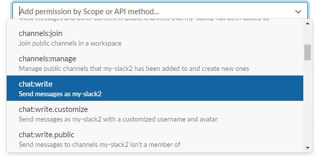
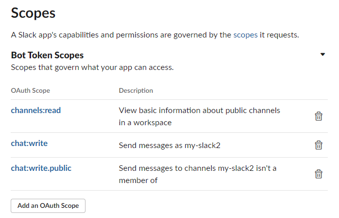

# slack 의 SIGNED_SECRET_KEY, BOT_USER_TOKEN 확인 방법
1. 아래 url 접속합니다.
```
https://api.slack.com/apps
```
2. "Create New App" 버튼을 클릭합니다. <br />
&nbsp;
3. "From scratch" 항목을 클릭합니다.<br />
&nbsp;
4. 앱이 적용될 워크스페이스를 선택한 후, "Create App" 버튼을 클릭합니다.<br />
&nbsp;
5. "Basic Information" 안의 "Add features and functionality" 을 클릭합니다.<br />
&nbsp;
6. "Permissions" 을 클릭합니다.<br />
&nbsp;
7. "Add an OAuth Scope" 버튼을 클릭합니다.<br />
&nbsp;
8. 권한 목록 중에 "channels:read", "chat:write", "chat:write.public" 을 선택합니다.<br />
&nbsp;<br />
&nbsp;
9. "OAuth Tokens for Your Workspace" 항목 안에 있는 "Install to Workspace" 버튼을 클릭합니다.<br />
&nbsp;
10. 그러면, 다음과 같이 SLACK_BOT_USER_TOKEN 을 확인할 수 있습니다.<br />
&nbsp;
11. 다시 "Basic Information" 으로 돌아가 맨 아래로 스크롤 하면 SLACK_SIGNED_SECRET_KEY 값도 확인 가능합니다.<br />
&nbsp;

<br />
<br />

# slack 채널 ID 확인 방법
1. 슬랙 앱에서 채널 위에 마우스 오른쪽을 클릭 후 "채널 세부정보 열기"를 클릭합니다. <br />
&nbsp;
2. 맨 아래로 스크롤 하면 채널 ID 를 확인 할 수 있습니다.<br />
&nbsp;

<br />
<br />

# 이 프로젝트 사용 방법

1. "Interactivity & Shortcuts" 에서 "Interactivity" 을 ON 으로 설정해줍니다.<br />
&nbsp;

2. 그러면 다음과 같이 Request URL 이 표시되는데 아래 이미지와 같이 url 을 입력해줍니다.<br />
&nbsp;

3. 다음은 "Event Subscriptions" 에서 "Enable Events" 을 ON 으로 설정해줍니다.<br />
&nbsp;

4. 그러면 다음과 같이 Request URL 이 표시되는데 아래 이미지와 같이 url 을 입력해줍니다.<br />
&nbsp;

5. "Subscribe to bot events" 에서 구독을 원하는 이벤트를 등록해줍니다.<br />
&nbsp;

6. 이 프로젝트를 git clone 받습니다.
```
git clone https://github.com/wisdomstar94/slack-bot-api.git
```
7. 클론 받은 프로젝트 경로로 이동합니다.
```
cd slack-bot-api
```
8. node package 를 설치합니다.
```
npm i
```
9. 다음과 같이 파일들을 copy 합니다.
```
cp .env.sample .env
cp src/customs/slackButtonCallback.sample.js src/customs/slackButtonCallback.js
cp src/customs/slackEventAction.sample.js src/customs/slackEventAction.js
cp src/customs/slackMessageBlocks.sample.js src/customs/slackMessageBlocks.js
```

10. .env 파일의 다음 항목들을 입력합니다.

| 변수명 | 설명 |
| --- | --- |
| COOKIE_SECRET_KEY | 쿠키 secret 값을 입력해주세요. |
| SLACK_SIGNED_SECRET_KEY | 위에서 확인한 slack 의 SIGNED_SECRET_KEY 값을 입력해주세요. |
| SLACK_BOT_USER_TOKEN | 위에서 확인한 slack 의 BOT_USER_TOKEN 값을 입력해주세요. |
| SLACK_CHANNEL_ID | 위에서 확인한 slack 의 채널 ID 를 입력해주세요. |

<br />
&nbsp;

11. pm2 패키지를 전역으로 설치합니다.
```
npm i -g pm2
```
12. 다음 명령어를 입력하여 프로젝트를 구동합니다.
```
pm2 start pm2.config.js
```
<br />
&nbsp;

13. 아래 엔드포인트를 호출하면 슬랙으로 메시지가 전송됩니다.
```
http://localhost:2510/slack/bot/message/send
```
&nbsp;<br />
&nbsp;

14. 메시지를 보낼 때 버튼도 같이 보내고 싶다면, http://localhost:2510/slack/bot/message/send 을 호출할 때 isButtonShow 값을 true 로 보내면 됩니다.<br />
&nbsp;<br />
&nbsp;

15. "src/customs/slackButtonCallback.js" 은 버튼 클릭 이벤트를 설정할 수 있습니다. <br />
&nbsp;

16. "src/customs/slackEventAction.js" 은 slack에서 발생하는 다양한 이벤트를 받아 처리할 수 있습니다.<br />
&nbsp;

17. "slackMessageBlocks.js" 은 슬랙으로 전송되는 메시지 내용 폼을 자유롭게 작성할 수 있습니다. <br />
&nbsp;